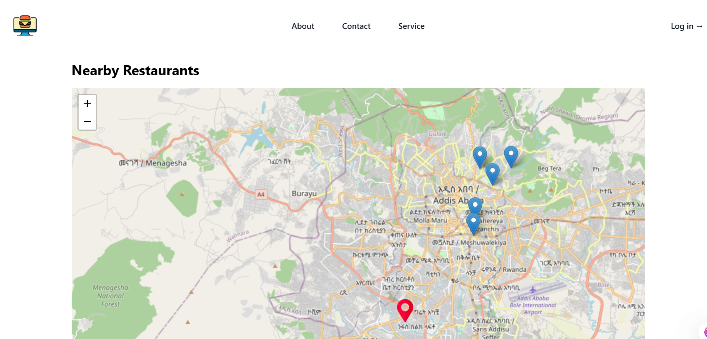

# Nearby Restaurant Locator App


## Description

The Nearby Restaurant Locator App is a full-stack web application developed using Next.js and Node.js. It allows users to discover restaurants within a 5 km radius of their current location, providing details such as name, address, distance, and opening hours. The application features an interactive map view with clickable markers for each restaurant.

## Table of Contents

- [Installation](#installation)
- [Usage](#usage)
- [Features](#features)
- [Technologies Used](#technologies-used)
- [License](#license)

## Installation

1. **Clone the repository:**

   ```bash
   git clone https://github.com/bonssss/Nearby_Restaurant.git
   cd Nearby_Restaurant
   ```
2. Set up the backend:

Navigate to the backend directory:
```bash
cd nearby-restaurant-backend
```
3. Install dependencies:
   ```bash
   npm installl
   ```
4. Set up environment variables by creating a .env file and adding the following:
   ```bash
   DATABASE_URL=your_database_url
5. Run database migrations:
   ```bash
   npx prisma migrate deploy
6. Start the backend server:
   ```bash
   npm start
7. Set up the frontend:

Navigate to the frontend directory:
```bash
cd nearby-restaurant-frontend
```
8. Install dependencies:
   ```bash
   npm install
9. Start the frontend server:
    ```bash
    npm run dev
  The application should now be running at http://localhost:3000

 ## Usage
Open the application in your browser.

The homepage will display a map with markers representing nearby restaurants.

Click on a marker to view details about the restaurant, including name, address, distance from your location, and opening hours.

## Features
Geolocation: Automatically detects the user's location to display nearby restaurants.

Interactive Map: Provides a visual representation of restaurant locations with clickable markers.

Restaurant Details: Displays essential information such as name, address, distance, and opening hours.

## Technologies Used
Frontend: Next.js

Backend: Node.js with Apollo Server

Database: PostgreSQL with Prisma ORM

Geolocation: Browser Geolocation API
  
